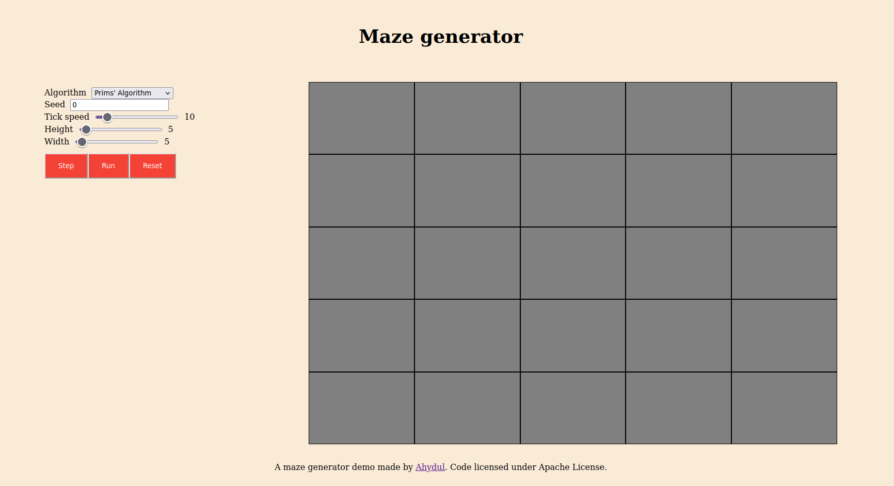

# Maze Generator


This is an elm demo with a couple of maze generators. Right now the generators implemented are [Prim's algorithm](http://weblog.jamisbuck.org/2011/1/10/maze-generation-prim-s-algorithm.html) and [Kruskal's algorithm](http://weblog.jamisbuck.org/2011/1/3/maze-generation-kruskal-s-algorithm). 



## Install

You have to have installed elm version 0.19.1. [Install](https://guide.elm-lang.org/install/elm)

Steps to test the demo:

```bash
git clone https://github.com/Ahydul/maze-generator-demo.git
cd maze-generator-demo
elm reactor
# The elm reactor command will server your files to http://localhost:8000,
# so go to http://localhost:8000 in your browser and select src/Main.elm.
```


## Features

Right now the demo is really small. You have a main page and another page you can go by clicking on generate. 
In this second page you can choose the algorithm to use, a seed, how fast the algorithm runs, the height and the width of the maze. 
The button step runs the generator one step. Run runs the generator until it's finished, with the speed set. Reset resets the maze.

